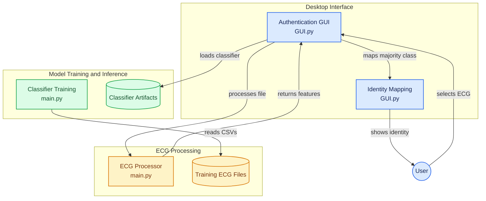

# ECG_Personal_Info_lock
Human Computer Interaction

## ECG Personal Information Lock — Architecture

```mermaid
flowchart TD

subgraph group_interface["Desktop Interface"]
  node_gui["Authentication GUI<br/>GUI.py"]
  node_identity["Identity Mapping<br/>GUI.py"]
end

subgraph group_signal["ECG Processing"]
  node_processor["ECG Processor<br/>main.py"]
  node_training_data[("Training ECG Files")]
end

subgraph group_learning["Model Training and Inference"]
  node_training["Classifier Training<br/>main.py"]
  node_models[("Classifier Artifacts")]
end

node_user(("User"))

node_user -->|"selects ECG"| node_gui
node_gui -->|"processes file"| node_processor
node_processor -->|"returns features"| node_gui
node_training -->|"reads CSVs"| node_training_data
node_gui -->|"loads classifier"| node_models
node_gui -->|"maps majority class"| node_identity
node_identity -->|"shows identity"| node_user

click node_gui "https://github.com/yassakamille/ecg_personal_info_lock/blob/main/GUI.py"
click node_processor "https://github.com/yassakamille/ecg_personal_info_lock/blob/main/main.py"
click node_training_data "https://github.com/yassakamille/ecg_personal_info_lock/tree/main/data"
click node_training "https://github.com/yassakamille/ecg_personal_info_lock/blob/main/main.py"
click node_models "https://github.com/yassakamille/ecg_personal_info_lock/tree/main/models"
click node_identity "https://github.com/yassakamille/ecg_personal_info_lock/blob/main/GUI.py"

classDef toneNeutral fill:#f8fafc,stroke:#334155,stroke-width:1.5px,color:#0f172a
classDef toneBlue fill:#dbeafe,stroke:#2563eb,stroke-width:1.5px,color:#172554
classDef toneAmber fill:#fef3c7,stroke:#d97706,stroke-width:1.5px,color:#78350f
classDef toneMint fill:#dcfce7,stroke:#16a34a,stroke-width:1.5px,color:#14532d
classDef toneRose fill:#ffe4e6,stroke:#e11d48,stroke-width:1.5px,color:#881337
classDef toneIndigo fill:#e0e7ff,stroke:#4f46e5,stroke-width:1.5px,color:#312e81
classDef toneTeal fill:#ccfbf1,stroke:#0f766e,stroke-width:1.5px,color:#134e4a

class node_gui,node_identity,node_user toneBlue
class node_processor,node_training_data toneAmber
class node_training,node_models toneMint
```

